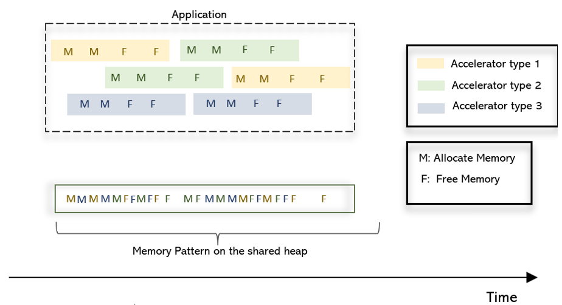
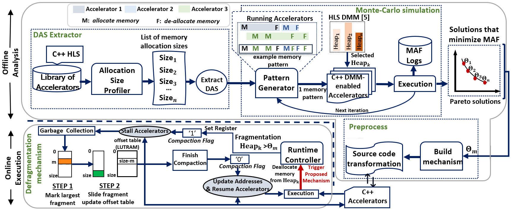
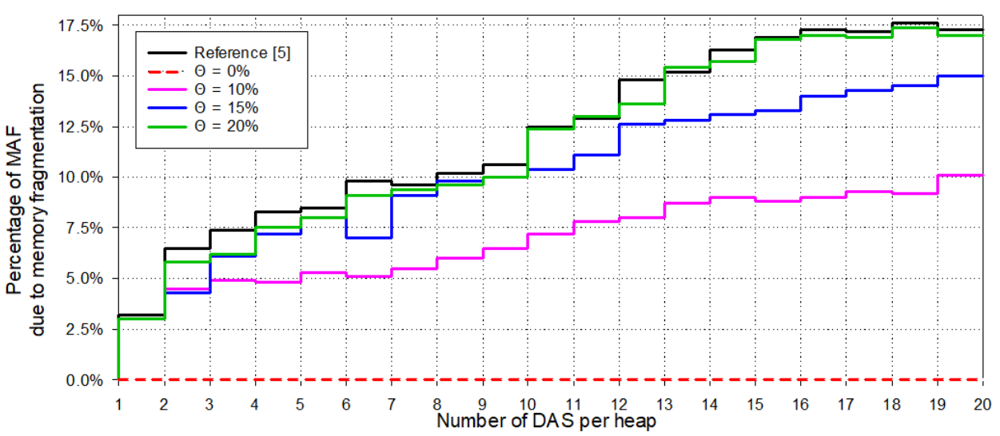
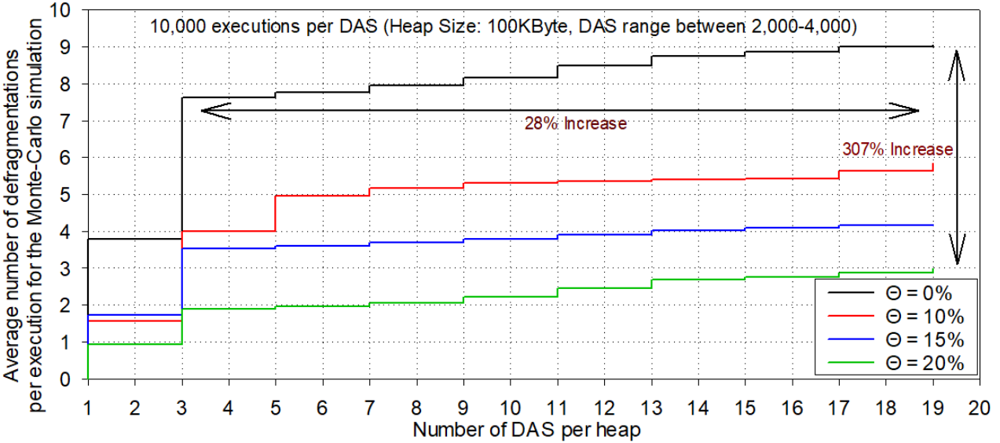

# Dynamic Heap Management in High-Level Synthesis
This repository is about an HLS synthesizable garbage collector and a methodology for reducing fragmentation of shared FPGA on-chip memories that are reused among multiple accelerators.
The garbage collector and the correspoding methodology were evaluated on the MemLuv DMM framework (https://github.com/diamantopoulos/memluv).
The implementation of the garbage collector is tailored to the Memluv framework. But the defragmentation methodology is applicable to any DMM framework and memory allocator. 

* The execution of multiple parallel accelerators on a shared heap may lead to memory fragmentation due the accelerators unpredictable execution order.

    

 
## Getting Started

(*required for the implementation*) The following steps are required for implementing the garbage collector on the Memluv DMM framework
### Implementation Prerequisites

* Download and Install Vitis 2020.1 (https://www.xilinx.com/support/download.html)
* Install the MemLuv framework (https://github.com/diamantopoulos/memluv)
* Import the /garbage_collector/compaction.c in the memluv.c file 
* Import the /garbage_collector/wrappers.c in the memluv_wrappers.c file
* Import the /garbage_collector/update.c in the malloc.c file
* Import the /garbage_collector/fragmentation.c in the memluv.c file and set the **Theta** parameter with the desired value ([0,1]
* Transform the HLS accelerators as it is described in /accelerators/README.md

## Methodology
An offline python-based Monte-Carlo (MC) analysis is performed on the accelerators that will be executed on the FPGA. This step is performed before synthesizing the garbage collector.
The goal of this analysis is to determine the value of the **Theta** parameter that is suitable for those accelerators and reduces the memory fragmentation. For additional information of this offline
Monte-Carlo analysis check /offline_analysis/README.md
* *The methodology*

    

* The offline analysis is performed on the distinct allocation sizes (DAS) of the accelerators that will be implemented on the FPGA. The Monte-Carlo analysis is performed in order to statistcially quantify
the probability of memory allocation failures due to heap fragmentation when those accelerators are executed in parallel on the FPGA.
* The **Theta** values that dictate when the garbage collector should be executed in order to decrease the heap fragmentation are the output of this analysis.
* From the set of all the solution that decrease allocation failures the designer selects one for the implementation based on the application's performance Vs memory efficiency requirements
* Typically, large **Theta** values lead to fewer executions of the garbage collector and higher performance while smaller **Theta** values the opposite.
 

## Evaluation
* The methodology and the execution of the garbage collector are tested on an Alveo U200 for 20 K-means accelerators that share one heap of 100 KB. The heap is implemented as a RAM_1WNR with BRAMs.
* More DAS per heap lead to higher probability of fragmentation due to the heterogeinity of the memory allocation sizes

    

* Smaller **Theta** leads to more execution of the garbage collector and reduces the accelerators' throughput

    

* Resource Overhead by the garbage collector for different heap sizes

| **Heap Size**  | **LUTs**     | **FFs**    | **DSPs**                 | **BRAMs**                | **URAMs**   |
|----------------|--------------|------------|--------------------------|--------------------------|-------------|
| 2 KB           | 2,977        | 1,566      | 0                        | 0 | 0 |
| 4 KB           | 3,232        | 1,663      | 0                        | 0 | 0 |
| 32 KB          | 6,345        | 1,787      | 0                        | 0 | 0 |
| 100 KB         | 25,345       | 2,467      | 0                        | 0 | 0 |
| 120 KB         | 29,645       | 2,843      | 0                        | 0 | 0 |
| 1 MB           | 75,945       | 6,000      | 0                        | 0 | 0 |
| 2 MB           | 141,291      | 6,120      | 0                        | 0 | 0 |
| 4 MB           | 272,412      | 6,345      | 0                        | 0 | 0 |
| 6 MB           |  403,462     | 6,543      | 0                        | 0 | 0 |
| 8 MB           | 534,612      | 6,612      | 0                        | 0 | 0 |
| 10 MB          | 645,651      | 6,638      | 0                        | 0 | 0 |

