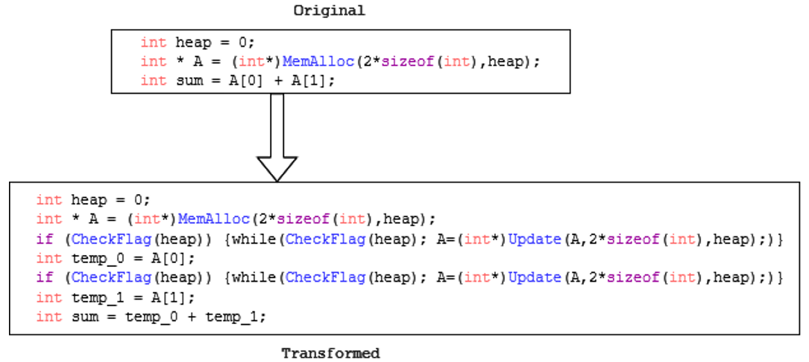

# Benchmarks
In this directory two benchmarks are given for evaluation
* 2D matrix matrix multiplication 
* Erasure Coding Encoder 

## Code Transformation
* To avoid memory access violations during the compaction a code transformation at the accelerators' source code is required before the memory access operations

    

* This is required as the garbage collector is executed asynchronously of the accelerators' execution.
