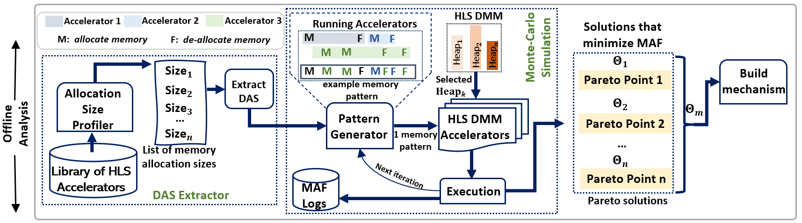
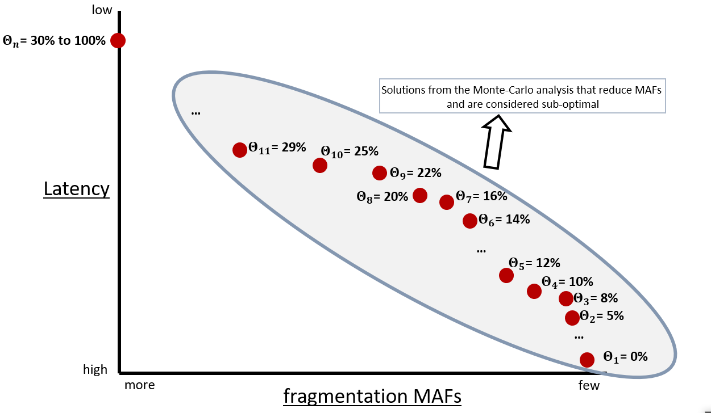

# Offline Monte Carlo Analysis
The code in this directory is used for the Monte-Carlo offline analysis
* Pseudo-random memory pattern are generated based on the distinct allocation sizes (DAS) of the accelerators that will be executed in parallel
* The *script.py* generates those memory pattern with tha *malloc/free* commands linked in order to retain their relative order
## Analysis
* The goal of this analysis is to find all the **Theta** values of that reduce memory fragmentation

    

* The output of the Monte-Carlo is sub-optimal points that trade-off performance Vs memory efficieny

    

